# Telegram Bot Integration - id.dos.me Requirements

## Overview

Bexly Telegram bot uses **JWT-based authentication** to link Telegram accounts with Bexly users via id.dos.me.

## Route Specification

### Endpoint
```
GET https://id.dos.me/login?redirect={redirect_url}&tg_token={jwt}
```

### Query Parameters

| Parameter | Type | Required | Description |
|-----------|------|----------|-------------|
| `redirect` | string (URL) | Yes | Deep link or URL to redirect after linking (e.g., `bexly://telegram/linked`) |
| `tg_token` | string (JWT) | Yes | Signed JWT containing telegram_id and app info |

### JWT Payload Structure

```typescript
{
  telegram_id: string;      // Telegram user ID
  app: string;              // "bexly"
  bot_username?: string;    // "@BexlyBot"
  api_url?: string;         // Edge Function URL (optional, has default)
  exp: number;              // Expiration timestamp (current + 600s)
}
```

### JWT Secret

Shared secret between Telegram bot and id.dos.me (stored in environment variables).

Example URL:
```
https://id.dos.me/login?redirect=bexly://telegram/linked&tg_token=eyJhbGciOiJIUzI1NiIsInR5cCI6IkpXVCJ9...
```

## Flow

```mermaid
sequenceDiagram
    User->>TelegramBot: Send message
    TelegramBot->>User: Reply with "🔗 Link Account" button
    User->>id.dos.me: Click button → /login?redirect=bexly://telegram/linked&tg_token=JWT

    alt User NOT logged in
        id.dos.me->>User: Show login page (Google OAuth)
        User->>id.dos.me: Complete login
    end

    id.dos.me->>Bexly Edge Function: POST /link-telegram with user JWT + telegram_id
    Bexly Edge Function->>Supabase: Create link in user_integrations table
    Bexly Edge Function->>id.dos.me: Return success
    id.dos.me->>User: Redirect to bexly://telegram/linked
```



## Backend Requirements (id.dos.me)

The implementation is in [apps/id/src/app/(auth)/callback/page.tsx](../../DOS-Me/apps/id/src/app/(auth)/callback/page.tsx).

### Flow Overview

1. **User clicks link**: `https://id.dos.me/login?redirect=bexly://telegram/linked&tg_token=JWT`
2. **Login page**: User logs in with Google OAuth (if not already logged in)
3. **Callback page**: Receives `tg_token` parameter after login
4. **Decode JWT**: Extract `telegram_id` and `app` from JWT (client-side decode only for reading)
5. **Call Edge Function**: POST to product's Edge Function with user's Supabase JWT and `telegram_id`
6. **Redirect**: After success, redirect to deep link (e.g., `bexly://telegram/linked`)

### Key Implementation Details

```typescript
// 1. Decode JWT (client-side)
const base64Url = tgToken.split('.')[1];
const base64 = base64Url.replace(/-/g, '+').replace(/_/g, '/');
const payload = JSON.parse(atob(base64));

// 2. Validate payload
if (!payload.telegram_id || !payload.app) {
  throw new Error('Invalid Telegram token payload');
}

// 3. Check expiration
if (payload.exp && payload.exp * 1000 < Date.now()) {
  throw new Error('Token expired. Please try again from Telegram bot.');
}

// 4. Call product Edge Function
const apiUrl = payload.api_url || getDefaultApiUrl(payload.app);
const response = await fetch(apiUrl, {
  method: 'POST',
  headers: {
    'Content-Type': 'application/json',
    'Authorization': `Bearer ${session.access_token}`,  // User's Supabase JWT
  },
  body: JSON.stringify({
    telegram_id: payload.telegram_id,
  }),
});

// 5. Redirect on success
window.location.href = getRedirectUrl(payload.app);
```

## Bexly Edge Function Requirements

### Endpoint: `link-telegram`

```typescript
// supabase/functions/link-telegram/index.ts
import { serve } from 'https://deno.land/std@0.168.0/http/server.ts';
import { createClient } from 'https://esm.sh/@supabase/supabase-js@2';

serve(async (req) => {
  // Get user JWT from Authorization header
  const authHeader = req.headers.get('Authorization');
  const token = authHeader?.replace('Bearer ', '');

  // Create Supabase client with user JWT
  const supabase = createClient(
    Deno.env.get('SUPABASE_URL')!,
    Deno.env.get('SUPABASE_ANON_KEY')!,
    { global: { headers: { Authorization: authHeader! } } }
  );

  // Verify user
  const { data: { user }, error: authError } = await supabase.auth.getUser(token);
  if (authError || !user) {
    return new Response(JSON.stringify({ error: 'Unauthorized' }), { status: 401 });
  }

  // Get telegram_id from body
  const { telegram_id } = await req.json();
  if (!telegram_id) {
    return new Response(JSON.stringify({ error: 'Missing telegram_id' }), { status: 400 });
  }

  // Check for existing links
  const { data: existing } = await supabase
    .from('user_integrations')
    .select('user_id')
    .eq('platform', 'telegram')
    .eq('platform_user_id', telegram_id)
    .maybeSingle();

  if (existing) {
    if (existing.user_id === user.id) {
      return new Response(JSON.stringify({ message: 'Already linked' }), { status: 200 });
    } else {
      return new Response(
        JSON.stringify({ error: 'Telegram account already linked to another user' }),
        { status: 409 }
      );
    }
  }

  // Insert link
  const { error: insertError } = await supabase
    .from('user_integrations')
    .insert({
      user_id: user.id,
      platform: 'telegram',
      platform_user_id: telegram_id,
      platform_metadata: { app: 'bexly' },
      linked_at: new Date().toISOString(),
      last_activity: new Date().toISOString(),
    });

  if (insertError) {
    return new Response(JSON.stringify({ error: insertError.message }), { status: 500 });
  }

  return new Response(JSON.stringify({ success: true }), { status: 200 });
});
```

## Supabase Configuration

### Database Table: `user_integrations`

Schema: `bexly`

```sql
CREATE TABLE IF NOT EXISTS bexly.user_integrations (
  id UUID PRIMARY KEY DEFAULT gen_random_uuid(),
  user_id UUID NOT NULL REFERENCES auth.users(id) ON DELETE CASCADE,
  platform TEXT NOT NULL CHECK (platform IN ('telegram', 'messenger')),
  platform_user_id TEXT NOT NULL,
  linked_at TIMESTAMP WITH TIME ZONE NOT NULL DEFAULT NOW(),
  last_activity TIMESTAMP WITH TIME ZONE NOT NULL DEFAULT NOW(),

  UNIQUE (platform, platform_user_id),
  UNIQUE (user_id, platform)
);
```

### Supabase Connection

Edge Function uses **Supabase Anon Key** with **user JWT** for RLS:

```typescript
const supabase = createClient(
  Deno.env.get('SUPABASE_URL'),
  Deno.env.get('SUPABASE_ANON_KEY'),
  {
    global: { headers: { Authorization: `Bearer ${userToken}` } },
    db: { schema: 'bexly' }
  }
);
```

## UI/UX Requirements

### Login Page (if not authenticated)

```
┌─────────────────────────────────┐
│         🔗 Link Telegram        │
│                                 │
│  Login to link your Telegram   │
│  account with Bexly             │
│                                 │
│  [ Continue with Google ]       │
│                                 │
└─────────────────────────────────┘
```

### Success Page

```
┌─────────────────────────────────┐
│             ✅                  │
│                                 │
│      Successfully Linked!       │
│                                 │
│  Your Telegram account is now   │
│  linked with Bexly.             │
│                                 │
│  You can close this window.     │
│                                 │
└─────────────────────────────────┘

Auto close after 3 seconds
```

### Error Page (already linked to another user)

```
┌─────────────────────────────────┐
│             ❌                  │
│                                 │
│        Already Linked           │
│                                 │
│  This Telegram account is       │
│  already linked to another      │
│  Bexly account.                 │
│                                 │
└─────────────────────────────────┘
```

## Security Considerations

1. **JWT Signature Verification**: Always verify JWT signature with shared secret
2. **Token Expiration**: JWT expires in 10 minutes (600s)
3. **HTTPS Only**: Never send JWT over HTTP
4. **Rate Limiting**: Prevent brute force linking attempts on Edge Function
5. **Session Security**: Ensure secure cookie settings (httpOnly, secure, sameSite)
6. **No Sensitive Data in JWT**: telegram_id is not sensitive, safe to include
7. **Shared Secret Storage**: Store JWT_SECRET in environment variables, never commit

## Testing

### Test Cases

1. ✅ **New link**: User not logged in → Login → Link success
2. ✅ **Already authenticated**: User logged in → Link success immediately
3. ✅ **Already linked (same user)**: Show "Already linked" message
4. ✅ **Already linked (different user)**: Show error
5. ✅ **Missing telegram_id**: Show error
6. ✅ **Invalid telegram_id**: Show error

### Generate Test JWT

```typescript
import jwt from 'jsonwebtoken';

const testToken = jwt.sign({
  telegram_id: '123456789',
  app: 'bexly',
  bot_username: 'BexlyBot',
  exp: Math.floor(Date.now() / 1000) + 600,
}, process.env.JWT_SECRET);

console.log(`https://id.dos.me/telegram/link?token=${testToken}`);
```

### Test URLs

```bash
# Not logged in (generate JWT first)
https://id.dos.me/login?redirect=bexly://telegram/linked&tg_token=<JWT>

# Already logged in (use real session + JWT)
https://id.dos.me/login?redirect=bexly://telegram/linked&tg_token=<JWT>

# Missing tg_token
https://id.dos.me/login?redirect=bexly://telegram/linked

# Expired token (set exp to past)
https://id.dos.me/login?redirect=bexly://telegram/linked&tg_token=<EXPIRED_JWT>
```

## Deep Link (Optional Enhancement)

After successful link, redirect to:
```
bexly://telegram/linked
```

This will open Bexly app (if installed) and show confirmation.

## Deployment Checklist

### id.dos.me
- [x] Update `/login` and `/callback` pages to support `tg_token` parameter
- [x] Implement JWT decoding (client-side)
- [x] Call Bexly Edge Function with user JWT after login
- [x] Add error handling for edge cases
- [x] Style linking/error pages
- [x] Add to redirect whitelist (`bexly://telegram/linked`)

### Bexly
- [x] Deploy `link-telegram` Edge Function
- [x] Set `JWT_SECRET` in Supabase secrets
- [x] Create `user_integrations` table with RLS
- [x] Update Telegram bot to generate JWT
- [ ] Test on staging environment
- [ ] Deploy bot to production
- [ ] Verify end-to-end flow

## Support

For questions or issues, contact Bexly team or check:
- Supabase project: https://supabase.com/dashboard/project/gulptwduchsjcsbndmua
- Telegram bot: https://t.me/BexlyBot
